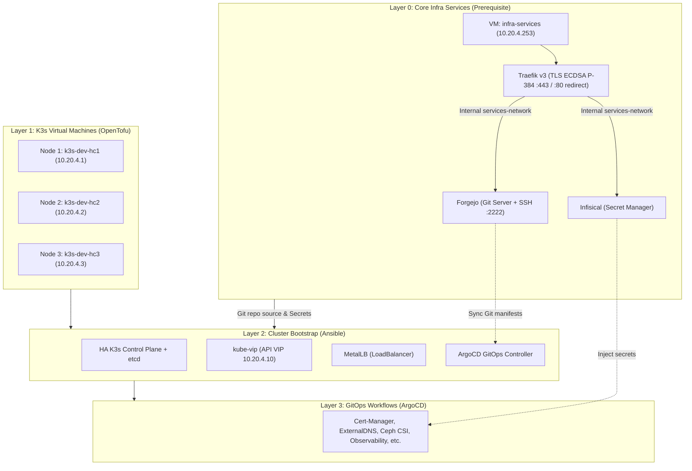

# 🚀 Hyperconverged Cluster Homelab: IaC & K3s & GitOps

This repository provides a complete solution for deploying a **Hyperconverged Infrastructure (HCI)** at home on a Proxmox VE cluster.

From core external services (local Git & Secrets management) to automated VM provisioning, high-availability K3s, and persistent Ceph storage, this project automates the entire stack using modern Infrastructure-as-Code (IaC) principles with **OpenTofu**, **Ansible**, and **ArgoCD**.

---

## 🏗️ Architecture & Logical Layers

The architecture is divided into decoupled layers to ensure maximum reliability and resolve any "chicken-and-egg" dependencies between GitOps, Secrets, and Kubernetes:



### Layer 0: Core Infrastructure Services (Prerequisite)
Located in [`iac-services/`](./iac-services/) and [`ansible-services/`](./ansible-services/):
- Provisions a dedicated standalone VM (`infra-services` at `10.20.4.253`) on Ceph storage (`pool1_ssd`) in Proxmox resource pool `Backup-Daily` with HA replication.
- Runs **Traefik v3** (HTTPS reverse proxy with 30-year ECDSA P-384 certificate), **Forgejo** (local Git server), and **Infisical** (external secrets manager) using **Podman Rootless** under an unprivileged user without sudo rights (`services`).
- **Security by Design**: Direct container web ports (`3000`, `8080`) are completely unmapped from the host and strictly isolated inside a private Podman network (`services-network`). UFW performs transparent local NAT redirection (`80 -> 8000`, `443 -> 8443`).
- **Automated Bootstrap**: Forgejo admin account is automatically created and credentials saved locally to [`ansible-services/output/forgejo-credentials.txt`](./ansible-services/output/forgejo-credentials.txt). Public registrations are disabled.
- **Production Hardened**: Infisical is hardened according to official standards (SSRF protection, JWT token lifetime reduction, Redis password authentication, and read-only container rootfs with tmpfs).
- **Why?** Having Git and Secrets hosted outside the Kubernetes cluster solves the bootstrap dependency problem and allows disaster recovery without relying on an operational K8s cluster.

### Layer 1: K3s Node Infrastructure (OpenTofu)
Located in [`iac-k3s/`](./iac-k3s/):
- Provisions the 3 K3s node VMs (`k3s-dev-hc1`, `k3s-dev-hc2`, `k3s-dev-hc3`) in Proxmox pool `Backup-Daily` with dual networking (`vmbr0` for LAN and `vmbr_ceph` for Ceph storage).

### Layer 2: Cluster Bootstrap (Ansible)
Located in [`ansible-k3s/`](./ansible-k3s/):
- Bootstraps the 3-node HA K3s cluster, kube-vip (API VIP), MetalLB, Traefik, SOPS Operator, and ArgoCD.

### Layer 3: GitOps Engine (ArgoCD)
Located in [`gitops/`](./gitops/):
- Continuously synchronizes add-ons and cluster infrastructure from your Forgejo Git repository (app-of-apps pattern).

---

## 📋 Global Prerequisites

### 🖥️ Infrastructure (Proxmox VE)
- **Functional Cluster**: Proxmox VE cluster (v8+ recommended).
- **Storage**: Ceph cluster running on Proxmox nodes (`pool1_ssd` pool for HA VM storage).
- **Resource Pool**: `Backup-Daily` pool for automated daily backup jobs.
- **Network**: VLAN 2004 (`10.20.4.0/24`) for LAN/Management and Ceph network (`10.20.3.0/24`).

### 💻 Control Machine
- **OpenTofu** (>= 1.11.0) or Terraform
- **Ansible** (>= 2.15)
- **kubectl**, **kustomize**, **sops**, **age**

---

## 🚀 Quick Start Guide

### Step 0: Deploy Infrastructure Services VM (Prerequisite)
Deploy the Forgejo, Infisical, and Traefik VM first:

```bash
# 1. Provision the infra-services VM on Proxmox
cd iac-services/
cp terraform.tfvars.example terraform.tfvars # Edit if needed
tofu init && tofu apply

# 2. Configure the OS, Podman Rootless, Traefik v3, Forgejo & Infisical
cd ../ansible-services/
ansible-playbook -i inventory/hosts.yml playbook.yml
```
* **Forgejo HTTPS**: `https://git.infra-services.local` (or `https://10.20.4.253` with Host header)
* **Forgejo Git SSH**: `ssh://git@git.infra-services.local:2222`
* **Infisical HTTPS**: `https://infisical.infra-services.local`
* **Admin Credentials**: saved locally in `ansible-services/output/forgejo-credentials.txt`

### Step 1: Deploy K3s Cluster VMs
```bash
cd ../iac-k3s/
cp terraform.tfvars.example terraform.tfvars # Edit if needed
tofu init && tofu apply
```

### Step 2: Bootstrap K3s & ArgoCD
```bash
cd ../ansible-k3s/
ansible-galaxy install -r requirements.yml
cp inventory/hosts.yml.example inventory/hosts.yml
cp inventory/group_vars/all.yml.example inventory/group_vars/all.yml # Edit configs!
ansible-playbook -i inventory/hosts.yml site.yml
```

### Step 3: ArgoCD GitOps Takes Over
ArgoCD will automatically synchronize manifests from Forgejo and deploy everything declared in [`gitops/`](./gitops/).

---

## 🤝 Acknowledgments
Based on [**ansible-role-k3s**](https://github.com/PyratLabs/ansible-role-k3s) by **Xan Manning**.
