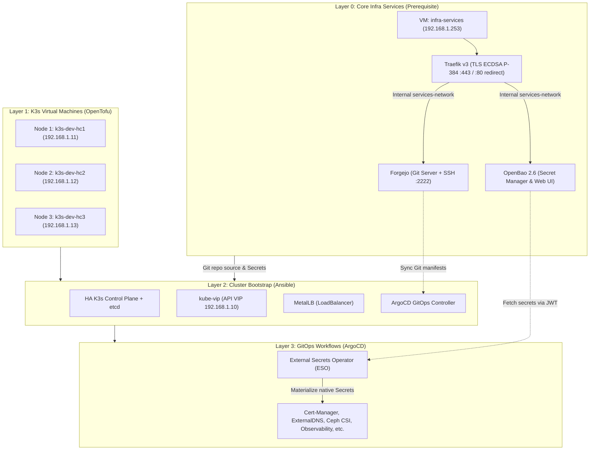

# 🚀 Hyperconverged Cluster Homelab: IaC & K3s & GitOps

This repository provides a complete solution for deploying a **Hyperconverged Infrastructure (HCI)** at home on a Proxmox VE cluster.

From core external services (local Git & Secrets management) to automated VM provisioning, high-availability K3s, and persistent Ceph storage, this project automates the entire stack using modern Infrastructure-as-Code (IaC) principles with **OpenTofu**, **Ansible**, and **ArgoCD**.

---

## 🏗️ Architecture & Logical Layers

The architecture is divided into decoupled layers to ensure maximum reliability and resolve any "chicken-and-egg" dependencies between GitOps, Secrets, and Kubernetes:



### Layer 0: Core Infrastructure Services (Prerequisite)
Located in [`iac-services/`](./iac-services/) and [`ansible-services/`](./ansible-services/):
- Provisions a dedicated standalone VM (`infra-services` at `192.168.1.253`) on Ceph storage (`pool1_ssd`) in Proxmox resource pool `Backup-Daily` with HA replication.
- Runs **Traefik v3** (HTTPS reverse proxy with 90-day ECDSA P-384 certificates auto-renewed by OpenBao PKI), **Forgejo** (local Git server), **OpenBao 2.6** (open-source secret manager with Raft storage & internal PKI), **Prometheus Node Exporter** (`:9100/metrics`), and **Grafana Alloy** (systemd journal & audit log streaming) using **Podman Rootless** under an unprivileged user without sudo rights (`services`).
- **Security by Design**: Direct container web ports (`3000`, `8200`) are completely unmapped from the host and strictly isolated inside a private Podman network (`services-network`). UFW performs transparent local NAT redirection (`80 -> 8000`, `443 -> 8443`).
- **Automated Bootstrap & Secrets Provisioning**:
  - Forgejo admin account is automatically created and credentials saved locally to [`ansible-services/output/forgejo-credentials.txt`](./ansible-services/output/forgejo-credentials.txt). Public registrations are disabled.
  - OpenBao is automatically initialized and unsealed. Root CA, KV v2 engine, security policies (`admin-policy`, `eso-k3s-policy`, `ansible-policy`, `traefik-cert-renewer-policy`), and AppRoles are provisioned on first boot.
  - Wildcard server certificate (`*.infra-services.local`, 90-day validity) is issued to Traefik, and a daily systemd user timer (`traefik-cert-renewer.timer`) automatically rotates it when fewer than 30 days remain.
  - Root CA is exported to [`ansible-services/output/openbao-ca.crt`](./ansible-services/output/openbao-ca.crt) and credentials (unseal keys, root token, AppRoles, admin password) are exported to [`ansible-services/output/openbao-credentials.txt`](./ansible-services/output/openbao-credentials.txt).
- **Production Hardened**: OpenBao is configured with integrated Raft storage, memory isolation (`IPC_LOCK`), declarative JSON audit device with logrotate, unauthenticated telemetry disabled, and container capabilities dropped (`ALL`).
- **Why?** Having Git and Secrets hosted outside the Kubernetes cluster solves the bootstrap dependency problem and allows disaster recovery without relying on an operational K8s cluster.

### Layer 1: K3s Node Infrastructure (OpenTofu)

Located in [`iac-k3s/`](./iac-k3s/):
- Provisions the 3 K3s node VMs (`k3s-dev-hc1`, `k3s-dev-hc2`, `k3s-dev-hc3`) in Proxmox pool `Backup-Daily` with dual networking (`vmbr0` for LAN and `vmbr_ceph` for Ceph storage).

### Layer 2: Cluster Bootstrap (Ansible)
Located in [`ansible-k3s/`](./ansible-k3s/):
- Bootstraps the 3-node HA K3s cluster, kube-vip (API VIP), MetalLB, Traefik, ArgoCD, and registers the cluster against OpenBao (`auth/kubernetes` engine for the External Secrets Operator).

### Layer 3: GitOps Workflows (ArgoCD)
Located in [`gitops/`](./gitops/):
- Continuously synchronizes add-ons and cluster infrastructure from your Forgejo Git repository (app-of-apps pattern), including External Secrets Operator (sync-wave -10), CSI storage drivers, cert-manager, external-dns, and observability.

---

## 📋 Global Prerequisites

### 🖥️ Infrastructure (Proxmox VE)
- **Functional Cluster**: Proxmox VE cluster (v8+ recommended).
- **Storage**: Ceph cluster running on Proxmox nodes (`pool1_ssd` pool for HA VM storage).
- **Resource Pool**: `Backup-Daily` pool for automated daily backup jobs.
- **Network**: LAN/Management network (`192.168.1.0/24`) and Ceph network (`192.168.2.0/24`).

### 💻 Control Machine
- **OpenTofu** (>= 1.11.0) or Terraform
- **Ansible** (>= 2.15)
- **kubectl**, **kustomize**

---

## 🚀 Quick Start Guide

### Step 0: Deploy Infrastructure Services VM (Prerequisite)
Deploy the Forgejo, OpenBao, and Traefik VM first:

```bash
# 1. Provision the infra-services VM on Proxmox
cd iac-services/
cp terraform.tfvars.example terraform.tfvars # Edit if needed
tofu init && tofu apply

# 2. Configure the OS, Podman Rootless, Traefik v3, Forgejo & OpenBao
cd ../ansible-services/
ansible-playbook -i inventory/hosts.yml playbook.yml
```
* **Forgejo HTTPS**: `https://git.infra-services.local`
* **Forgejo Git SSH**: `ssh://git@git.infra-services.local:2222`
* **OpenBao HTTPS**: `https://openbao.infra-services.local`
* **Root CA**: saved locally in `ansible-services/output/openbao-ca.crt` (to import into trust store)
* **Credentials**: saved locally in `ansible-services/output/` (`forgejo-credentials.txt` & `openbao-credentials.txt`)


### Step 1: Deploy K3s Cluster VMs
```bash
cd ../iac-k3s/
cp terraform.tfvars.example terraform.tfvars # Edit if needed
tofu init && tofu apply
```

### Step 2: Bootstrap K3s & ArgoCD
```bash
cd ../ansible-k3s/
ansible-galaxy install -r requirements.yml
cp inventory/hosts.yml.example inventory/hosts.yml
cp inventory/group_vars/all.yml.example inventory/group_vars/all.yml # Edit configs!
ansible-playbook -i inventory/hosts.yml playbook.yml
```

### Step 3: ArgoCD GitOps Takes Over
ArgoCD will automatically synchronize manifests from Forgejo and deploy everything declared in [`gitops/`](./gitops/).

---

## 🤝 Acknowledgments
Based on [**ansible-role-k3s**](https://github.com/PyratLabs/ansible-role-k3s) by **Xan Manning**.
