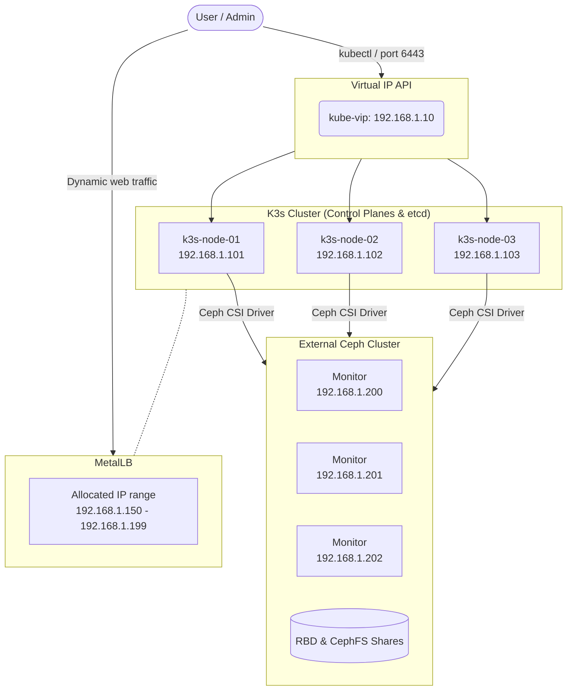

# HA K3s Cluster with Ansible

This project automates the deployment of a highly available (HA) K3s cluster using Ansible.

It includes the following elements out of the box:

- **3 Control Plane nodes** with embedded etcd for resilient data.
- **[kube-vip](https://kube-vip.io/)** to provide a virtual IP (VIP) to access the Kubernetes API server, running here in ARP mode.
- **[MetalLB](https://metallb.universe.tf/)** to provide IPs accessible on the local network for `LoadBalancer` type services.
- **Ceph CSI** to automatically connect the cluster to your existing Proxmox/Ceph distributed storage, providing persistent volumes via RBD and CephFS.

The deployment uses the highly popular Ansible role [ansible-role-k3s](https://github.com/PyratLabs/ansible-role-k3s).

## Prerequisites

- **Ansible >= 2.10** installed on the machine running the commands.
- **Python 3** with the `netaddr` package installed locally (`pip3 install netaddr`).
- Configured SSH key access to all your target servers/VMs (the playbook uses the `ubuntu` user by default, who has passwordless `sudo` rights).
- **Network reachability** from the K3s nodes to the Ceph monitor IPs (ports `3300` / `6789`). If the K3s network and the Ceph network are different VLANs/subnets, make sure they are routed and that no firewall (e.g. the Proxmox datacenter/node firewall) rejects the Ceph monitor ports.

## Preparing the Ceph cluster

The CSI driver connects to an **existing** Ceph cluster (e.g. a Proxmox Ceph). Before running Ansible, the following objects must exist on the Ceph side and their values reported in `inventory/group_vars/all.yml`. Run these commands from a machine that has the `ceph` CLI (a Proxmox node, or wherever your admin keyring is).

### 1. The RBD pool and CephFS filesystem must exist

```bash
ceph osd pool ls | grep pool1_ssd          # RBD pool used by the ceph-rbd StorageClass
ceph fs ls | grep cephfs1_ssd             # CephFS filesystem used by the ceph-cephfs StorageClass
ceph fs status cephfs1_ssd
```

Create them if missing (names must match `ceph_rbd_pool` and `cephfs_fs_name` in `all.yml`).

### 2. Get the real monitor addresses

```bash
ceph mon dump
```

Use the IPs from the `mon addr` column as `ceph_monitors` in `all.yml`. **Do not** guess them — wrong monitor IPs make provisioning hang with `context deadline exceeded`.

### 3. Create the dedicated Ceph user (RBD + CephFS caps)

Using a dedicated user (e.g. `k3s-ceph-dev`) rather than `client.admin` is strongly recommended. The CSI needs RBD caps (for the block driver) **and** CephFS caps (for the shared filesystem driver):

```bash
ceph auth get-or-create client.k3s-ceph-dev \
  mon "profile rbd, allow r" \
  mgr "profile rbd, allow rw" \
  osd "profile rbd pool=pool1_ssd, profile rbd pool=.mgr, allow rw pool=cephfs1_ssd_data, allow rw pool=cephfs1_ssd_metadata" \
  mds "allow rws path=/volumes/csi"
```

> The `pool1_ssd`, `cephfs1_ssd_data` and `cephfs1_ssd_metadata` names above are the **example values** (matching `all.yml.example`). Substitute your own: the RBD pool is `ceph_rbd_pool`, the CephFS data/metadata pool names are those reported by `ceph fs ls` for your filesystem (Proxmox names them `<fsname>_data` and `<fsname>_metadata` by default).

Cap breakdown:

| Daemon | Cap | Why |
| ------ | --- | --- |
| `mon` | `profile rbd, allow r` | RBD operations + read-only monitor access for CephFS metadata. |
| `mgr` | `profile rbd, allow rw` | RBD provisioning/metadata (`profile rbd`) + CephFS subvolume path/management via the manager `volumes` module (`allow rw`). Without `allow rw` the CephFS node plugin fails to mount with `does your client key have mgr caps?`. |
| `osd` | `profile rbd pool=pool1_ssd` | Read/write RBD images in the block pool. |
| `osd` | `profile rbd pool=.mgr` | RBD metadata stored in the `.mgr` pool. |
| `osd` | `allow rw pool=cephfs1_ssd_data` | Read/write CephFS file data. |
| `osd` | `allow rw pool=cephfs1_ssd_metadata` | Read/write CephFS metadata (omap, subvolumes). |
| `mds` | `allow rws path=/volumes/csi` | Create/manage subvolumes inside the `csi` subvolume group. |

Retrieve the secret key and put it in `all.yml` as `ceph_client_key`:

```bash
ceph auth print-key client.k3s-ceph-dev
```

> The user name (`k3s-ceph-dev`) goes into `ceph_client_id`, the key into `ceph_client_key`. The same credentials are used for both the RBD and the CephFS secrets.

### 4. Create the CephFS subvolume group

The CephFS driver places each PVC in a **subvolume group** (default name `csi`, configurable via `cephfs_subvolumegroup`). This group must exist on the Ceph side, otherwise PVC creation fails with `subvolume group 'csi' does not exist`:

```bash
ceph fs subvolumegroup create cephfs1_ssd csi
ceph fs subvolumegroup ls cephfs1_ssd        # → csi
```

The `mds` cap above (`allow rws path=/volumes/csi`) must match this group name: the subvolume group `csi` lives at `/volumes/csi` in the filesystem.

## Quick Start

### 1. Install the dependency role

Before starting, download the Ansible dependency:

```bash
cd ansible-k3s
ansible-galaxy install -r requirements.yml
```

### 2. Customize the configuration

Copy the provided example configuration files to adapt them to your infrastructure:

```bash
cp inventory/hosts.yml.example inventory/hosts.yml
cp inventory/group_vars/all.yml.example inventory/group_vars/all.yml
```

- **`inventory/hosts.yml`**: Add the actual IPs of your machines and their login credentials here.
- **`inventory/group_vars/all.yml`**: Adjust configuration variables such as the VIP address, MetalLB IP range, and your Ceph credentials.

> **Important**: Never commit `hosts.yml` and `all.yml` if they contain or will contain passwords (like `ceph_client_key`). The directory already uses `.gitignore` to prevent accidental leaks, but be careful.

#### Main variables (`all.yml`)

Here are some important variables based on the provided examples:

| Variable              | Example                                | Explanation                                                            |
| --------------------- | -------------------------------------- | ---------------------------------------------------------------------- |
| `k3s_release_version` | `stable`                               | K3s version to deploy (can be a specific release like `v1.31.2+k3s1`). |
| `k3s_vip`             | `192.168.1.10`                         | The target IP for kube-vip. This IP must be available on the network.  |
| `k3s_vip_interface`   | `{{ ansible_default_ipv4.interface }}` | On which network interface to share the VIP.                           |
| `metallb_ip_range`    | `192.168.1.150-192.168.1.199`          | The IP range dynamically assigned by MetalLB to your applications.     |
| `ceph_csi_operator_version` | `v1.0.4`                         | The [ceph-csi-operator](https://github.com/ceph/ceph-csi-operator) release deployed (CRDs, RBAC and operator manifests are pulled from this tag). |
| `ceph_client_id`      | `admin`                                | The Ceph user used by the CSI driver to authenticate storage requests. |
| `ceph_client_key`     | `YOUR-CEPH-KEYRING...`                 | The secret key that allows K3s to authenticate storage requests.       |
| `ceph_monitors`       | `['192.168.1.200', ...]`               | The IPs of the available Ceph monitors on the network.                 |
| `ceph_rbd_pool`       | `pool1_ssd`                            | The existing Ceph RBD pool backing the `ceph-rbd` StorageClass.        |
| `cephfs_fs_name`      | `cephfs1_ssd`                          | The existing CephFS filesystem backing the `ceph-cephfs` StorageClass. |
| `cephfs_subvolumegroup` | `csi`                                | The CephFS subvolume group used by the CephFS driver (must exist in Ceph). |
| `ceph_sc_rbd_name`    | `ceph-rbd`                             | Name of the RBD StorageClass (the `storageClassName` to reference in a PVC). |
| `ceph_sc_cephfs_name` | `ceph-cephfs`                          | Name of the CephFS StorageClass (the `storageClassName` to reference in a PVC). |

#### Tested component versions

The versions below are the ones currently pinned in `inventory/group_vars/all.yml` (the source of truth) and mirrored in `all.yml.example`. Keep them in sync when you bump a component, and re-test the cluster after any change.

| Component               | Variable                  | Version  |
| ----------------------- | ------------------------- | -------- |
| K3s (channel)           | `k3s_release_version`     | `stable` |
| kube-vip                | `kube_vip_version`        | `v1.2.1` |
| MetalLB                 | `metallb_version`         | `v0.16.1`|
| Ceph CSI Operator       | `ceph_csi_operator_version` | `v1.0.4`|

> K3s follows the `stable` channel, which is a moving target. For stricter reproducibility you may pin a specific release (e.g. `v1.31.2+k3s1`) instead.

### 3. Run the deployment

Simply run the playbook:

```bash
ansible-playbook -i inventory/hosts.yml site.yml
```

## Architecture

The generated architecture, based on the default dummy variables of the project (`all.yml.example` and `hosts.yml.example`), looks like this:



## Project Structure

```
ansible-k3s/
├── ansible.cfg                          # Local Ansible settings
├── requirements.yml                     # Dependencies (the k3s role)
├── site.yml                             # The installation playbook
├── inventory/
│   ├── hosts.yml.example                # Blank inventory with your target nodes
│   └── group_vars/
│       └── all.yml.example              # Centralization of cluster variables
└── templates/
    ├── 01-kube-vip-rbac.yml.j2          # Manifest files injected by the role
    ├── 02-kube-vip-daemonset.yml.j2
    ├── 04-metallb-config.yml.j2
    ├── 05-ceph-secrets.yml.j2
    ├── 06-ceph-storageclasses.yml.j2
    └── 10-ceph-csi-operator-config.yml.j2
```

## Verification

To check the health of the deployed component, you can run these queries:

```bash
# Retrieve the remote configuration file for kubectl
scp ubuntu@<A-NODE-IP>:/etc/rancher/k3s/k3s.yaml ~/.kube/config

# Update the server URL inside the config to use the VIP instead of 127.0.0.1
sed -i 's/127.0.0.1/YOUR_VIP_ADDRESS/' ~/.kube/config

# Check the presence of the servers
kubectl get nodes -o wide

# Diagnose the kube-vip interface
kubectl get pods -n kube-system -l app.kubernetes.io/name=kube-vip-ds

# Verify MetalLB
kubectl get pods -n metallb-system

# Verify the Ceph storage configuration
kubectl get pods -n ceph-csi-operator-system
kubectl get cephconnection,clientprofile,driver -n ceph-csi-operator-system
kubectl get csidriver
kubectl get storageclass
```
