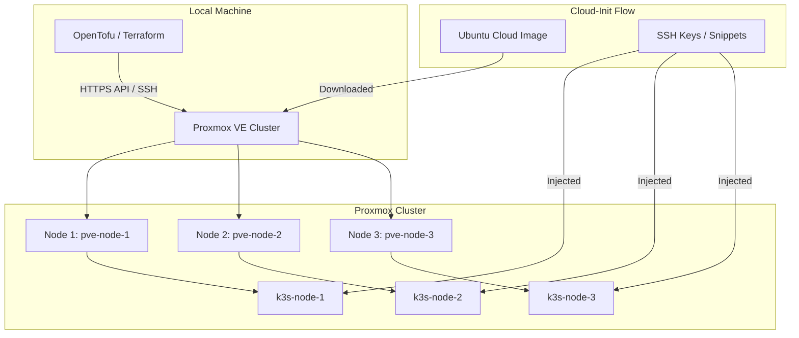

# Proxmox K3s Cluster Infrastructure (IaC — OpenTofu)

This directory manages the automated deployment of Ubuntu 24.04 (Noble Numbat) / 26.04 (Resolute Numbat) Virtual Machines on a Proxmox VE cluster using **OpenTofu** (or Terraform) for the **K3s Kubernetes cluster nodes**.

## 🏗️ Architecture



## 🚀 Features

- **Automated Image Management**: Downloads the Ubuntu Cloud-Init image directly to Proxmox nodes.
- **Cloud-Init Integration**: 
    - Automatic injection of SSH keys.
    - Post-install configuration via `vendor_data` snippets (e.g., QEMU Guest Agent).
    - **QEMU Guest Agent** installed and enabled by default.
- **Resource Pool Management**: Automatically assigns all cluster VMs to the Proxmox resource pool `Backup-Daily` (`pool_id = "Backup-Daily"`) for unified backup schedules.
- **Multi-NIC Networking**: Supports dual network interfaces per node (e.g. `vmbr0` for LAN/Management and `vmbr_ceph` for Ceph storage).
- **Hardware-Agnostic**: Configurable CPU (cores/type), Memory, Disk size, and Machine type (q35/pc).
- **UEFI Support**: Optional BIOS (SeaBIOS) or UEFI (OVMF) configuration.

## 📋 Prerequisites

Before deploying the K3s VMs, ensure:

1. **Infrastructure Services (Prerequisite)**: The persistent services VM (`infra-services` hosting Forgejo and Infisical) is deployed via [`../iac-services/`](../iac-services/) and configured with [`../ansible-services/`](../ansible-services/).
2. **Proxmox VE Cluster**: One or more nodes with Proxmox installed and accessible via API.
3. **Storage & Bridges**: Datastores (`local`, `local-lvm`, `pool1_ssd`) and network bridges (`vmbr0`, `vmbr_ceph`) configured.

## 🛠️ Installation & Setup

```bash
# 1. Initialize OpenTofu
tofu init

# 2. Configure Variables
cp terraform.tfvars.example terraform.tfvars # Edit if needed

# 3. Check and apply the execution plan
tofu plan
tofu apply
```

Once the K3s node VMs are up and running, proceed to [`../ansible-k3s/`](../ansible-k3s/) to bootstrap the Kubernetes cluster.
