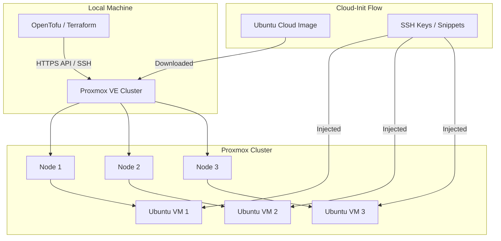

# Proxmox Homelab Infrastructure (IaC)

This project manages the automated deployment of Ubuntu 24.04 (Noble Numbat) Virtual Machines on a Proxmox VE cluster using **OpenTofu** (or Terraform). It is designed to provide a solid foundation for a K3s cluster or other homelab services.

## 🏗️ Architecture



## 🚀 Features

- **Automated Image Management**: Downloads the latest Ubuntu 24.04 Cloud-Init image directly to Proxmox nodes.
- **Cloud-Init Integration**: 
    - Automatic injection of SSH keys.
    - Post-install configuration via `vendor_data` snippets (e.g., QEMU Guest Agent).
    - **QEMU Guest Agent** installed and enabled by default.
- **Flexible Networking**: Supports multiple network interfaces per VM with custom bridges and VLAN tags.
- **Hardware-Agnostic**: Configurable CPU (cores/type), Memory, Disk size, and Machine type (q35/pc).
- **UEFI Support**: Optional BIOS (SeaBIOS) or UEFI (OVMF) configuration.

## 📋 Prerequisites

Before deploying, ensure you have:

1.  **Proxmox VE Cluster**: One or more nodes with Proxmox installed.
2.  **API Token**: An API token created in Proxmox (e.g., `root@pam!mytoken`).
    - Go to: *Datacenter > Permissions > API Tokens*.
3.  **SSH Access**: Enabled SSH on your Proxmox nodes for the provider to communicate.
4.  **Network Bridges**: Bridges (like `vmbr0`) must exist on the Proxmox nodes.
5.  **Storage**: 
    - A datastore for ISOs/Snippets (default: `local`).
    - A datastore for VM disks (default: `local-lvm`).

## 🛠️ Installation & Setup

### 1. Install OpenTofu
We recommend using [OpenTofu](https://opentofu.org/), but it is also compatible with Terraform >= 1.11.0.

### 2. Configure Variables
Copy the example variables file:

```bash
cp terraform.tfvars.example terraform.tfvars
```

Edit `terraform.tfvars` and fill in your details.

### 3. Initialize & Deploy

```bash
# Initialize the project and download providers
tofu init

# Check the execution plan
tofu plan

# Apply the changes
tofu apply
```

## ⚙️ Configuration Reference

### Provider Settings
| Variable | Description | Default |
|----------|-------------|---------|
| `proxmox_api_url` | URL of the Proxmox API | - |
| `proxmox_api_token` | Proxmox API token (`USER@REALM!TOKENID=UUID`) | - |
| `proxmox_ssh_username`| SSH user for Proxmox connection | `root` |
| `proxmox_insecure` | Disable TLS certificate verification | `true` |

### VM Configuration (`vm_config`)
The `vm_config` map is the heart of the deployment. Each entry defines a VM:

```hcl
vm_config = {
  "vm-name" = {
    node_name          = "pve-node-1"
    network_interfaces = [
      { 
        bridge  = "vmbr0"
        address = "10.0.0.10/24"
        gateway = "10.0.0.1"   # Optional for additional interfaces
        vlan_id = 10           # Optional VLAN tag
      }
    ]
  }
}
```

### Resource Defaults
| Category | Variable | Description | Default |
|----------|----------|-------------|---------|
| **Computing** | `vm_cpu_cores` | Number of vCPU cores | `16` |
| | `vm_cpu_type` | CPU emulation type | `x86-64-v2-AES` |
| | `vm_memory_mb` | RAM in MiB | `24576` (24 GiB) |
| **Storage** | `vm_disk_size_gb` | OS Disk size in GiGiB | `120` |
| | `vm_disk_datastore_id` | Proxmox storage identifier | `local-lvm` |
| **Image** | `ubuntu_cloud_image_url` | Ubuntu image URL | [Cloud Images](https://cloud-images.ubuntu.com/noble/current/noble-server-cloudimg-amd64.img) |
| **Access** | `vm_user` | Default SSH user | `ubuntu` |
| | `ssh_public_key` | SSH key to inject | - |

## 📊 Outputs

After a successful deployment, the following information is available:

- `vm_ids`: A map of VM names to their Proxmox VM IDs.
- `vm_ips`: A map of VM names to their configured IP addresses (all interfaces).

Use `tofu output` to view them.

## 🔍 Troubleshooting

- **QEMU Guest Agent**: If the Proxmox UI shows "Guest Agent not running", wait a few minutes after the first boot. The Cloud-Init script installs it on the first launch.
- **Disk Space**: Ensure the `image_datastore_id` (default `local`) has enough space to hold the Ubuntu Cloud image (~600MB).
- **API Connection**: If you get a 401 Unauthorized, double-check your API token format and permissions.

---
> [!TIP]
> You can easily scale your cluster by adding entries to the `vm_config` map and running `tofu apply` again.
